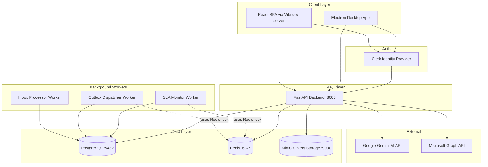

# QEMS (Probare) — Comprehensive System Documentation

> **Document Status:** Living reference | **Last Updated:** 2026-09-26 | **Author:** Generated via full codebase read

---

## 1. EXECUTIVE OVERVIEW

### What This System Does

**Probare** (Latin: "to test/prove") is an enterprise-grade **Quality Error Management System (QEMS)**. It provides a structured, auditable platform for organizations to document, review, contest, investigate, remediate, and prevent recurring quality errors — typically in BPO (Business Process Outsourcing), financial services, or any regulated industry where employee error tracking and SLA governance is critical.

In plain language: when an employee makes an error — a wrong data entry, a missed compliance step, a customer handling failure — a supervisor logs it in QEMS. The employee can then dispute (rebuttal) the error. If upheld, a root cause analysis is performed, corrective actions are assigned, and finally the fixes are reviewed for effectiveness before the case is closed. Every step is time-boxed by SLA policies and produces a full audit trail.

### Who the End Users Are

| Role | What They Do in QEMS |
|---|---|
| **Frontline Employee** | Receives quality error findings, reviews them, may file a Rebuttal |
| **QA Auditor** | Logs new quality events, reviews evidence, monitors queues |
| **QA Reviewer / QA Manager** | Conducts QA Review of rebuttals, makes final decisions |
| **Team Lead** | Views team-level events, escalates, may file Rebuttal on behalf |
| **Quality Governance** | Oversees all events across projects, manages SLA policies |
| **Executive / Leadership** | Reads analytics and dashboards, views executive KPIs |
| **System Administrator** | Manages users, roles, configurations, SLA policies |

The application is also consumed by **background workers** (SLA monitor, Outbox processor, Inbox processor) and optionally by **external integrations** (Microsoft 365 / Teams, AI APIs).

### Core Problem It Solves

Most organizations track quality errors in spreadsheets or ticketing systems that:
- Have no enforcement of process steps (anyone can skip RCA or CAPA)
- Have no SLA timer awareness (deadlines are missed silently)
- Lack a formal dispute/rebuttal mechanism with structured outcomes
- Produce no audit trail usable for regulatory compliance

QEMS enforces a strict, state-machine-governed lifecycle, automatically tracks SLA, enforces role-based access so only the correct person can perform each action, and produces a full, immutable audit trail.

### High-Level Architecture



---

## 2. TECH STACK & DEPENDENCIES

### Backend

| Dependency | Version | Purpose |
|---|---|---|
| Python | 3.12 (Dockerfile) | Runtime language |
| FastAPI | >=0.110.0 | Async HTTP framework. Chosen for async-native design, Pydantic integration, and auto-generated OpenAPI docs |
| Uvicorn | >=0.29.0 | ASGI server. Runs FastAPI |
| Pydantic | >=2.6.4 | Request/response schema validation, Settings management |
| pydantic-settings | >=2.2.1 | `.env` loading into `Settings` class |
| SQLAlchemy | >=2.0.29 | ORM for PostgreSQL. Async-native via `AsyncSession` |
| asyncpg | >=0.29.0 | Async PostgreSQL driver |
| Alembic | >=1.13.1 | Database migration tool |
| Redis | >=5.0.3 | Distributed locking for background workers, rate limiting |
| httpx | >=0.27.0 | Async HTTP client (used for MinIO health check, AI calls) |
| pytest | >=8.1.1 | Test framework |
| pytest-asyncio | >=0.23.6 | Async test support |
| python-dotenv | >=1.0.1 | `.env` file loading |
| loguru | >=0.7.2 | Structured logging |
| PyJWT | >=2.8.0 | JWT decoding for Clerk and Entra tokens |
| cryptography | >=42.0.0 | Required by PyJWT for RSA key handling |
| fastapi-limiter | >=0.1.6 | Rate limiting (partially integrated; Redis-backed) |
| aioboto3 | >=12.3.0 | Async S3/MinIO client for evidence uploads |
| python-multipart | >=0.0.9 | Form/multipart handling (file uploads) |
| python-magic | >=0.4.27 | MIME type detection via magic bytes |
| APScheduler | >=3.10.4 | Background job scheduling (SLA, Outbox, Inbox workers) |

### Frontend

| Dependency | Version | Purpose |
|---|---|---|
| React | ^19.0.1 | UI framework |
| TypeScript | ~5.8.2 | Type safety |
| Vite | ^6.2.3 | Frontend build tool and dev server |
| Electron | ^44.4.1 | Desktop application wrapper |
| electron-builder | ^26.15.3 | Packaging Electron into distributable |
| @clerk/clerk-react | ^5.61.10 | Clerk auth hooks (`SignedIn`, `SignedOut`, `useUser`) |
| @tanstack/react-query | ^5.103.1 | Server state management, data fetching, cache invalidation |
| axios | ^1.20.0 | HTTP client for API calls |
| lucide-react | ^0.546.0 | Icon library |
| motion | ^12.23.24 | Animation library |
| tailwindcss | ^4.1.14 | Utility-first CSS |
| @tailwindcss/vite | ^4.1.14 | Tailwind Vite plugin |
| concurrently | ^10.0.5 | Run Vite + Electron simultaneously in dev |
| wait-on | ^9.1.0 | Wait for Vite dev server before launching Electron |
| esbuild | ^0.25.0 | Bundle Electron main and preload scripts |
| cross-env | ^10.1.0 | Cross-platform environment variable setting |

### Infrastructure (docker-compose.yml)

| Service | Image | Port | Purpose |
|---|---|---|---|
| postgres | postgres:16-alpine | 5432 | Primary application database |
| test-postgres | postgres:16-alpine | 5434 | Isolated database for pytest runs |
| redis | redis:7-alpine | 6380→6379 | Distributed locking, rate limiting |
| minio | quay.io/minio/minio:latest | 9000 (API), 9001 (Console) | S3-compatible object storage for evidence files |
| backend | python:3.12-slim (Dockerfile) | 8000 | FastAPI application |

### Environment Variables

**Backend (`backend/.env`)**

| Variable | Required | Description |
|---|---|---|
| `APPLICATION_ENV` | Yes | `development`, `testing`, or `production`. Controls scheduler, seeding safety, and validation rules |
| `API_V1_STR` | No | API prefix, default `/api/v1` |
| `PROJECT_NAME` | No | App title shown in OpenAPI docs |
| `DATABASE_URL` | Yes | PostgreSQL connection string (must use `postgresql+asyncpg://` for async) |
| `REDIS_URL` | Yes | Redis connection string |
| `STORAGE_ENDPOINT` | Yes | MinIO endpoint URL |
| `STORAGE_ACCESS_KEY` | Yes | MinIO access key |
| `STORAGE_SECRET_KEY` | Yes | MinIO secret key |
| `STORAGE_BUCKET` | Yes | MinIO bucket name for evidence |
| `AUTH_PROVIDER` | No | `clerk`, `entra`, or `development`. Default `entra` |
| `CLERK_ISSUER_URL` | Clerk only | Clerk instance URL (e.g. `https://live-goose-7262.clerk.accounts.dev`) |
| `CLERK_PUBLISHABLE_KEY` | Clerk only | Clerk publishable key |
| `CLERK_SECRET_KEY` | Clerk only | Clerk secret key |
| `MICROSOFT_CLIENT_ID` | Entra only | Azure AD app client ID |
| `MICROSOFT_TENANT_ID` | Entra only | Azure AD tenant ID |
| `MICROSOFT_CLIENT_SECRET` | Entra only | Azure AD app client secret |
| `MICROSOFT_REDIRECT_URI` | Entra only | OAuth redirect URI |
| `MS_GRAPH_WEBHOOK_SECRET` | Optional | MS Graph webhook validation secret |
| `TEAMS_WEBHOOK_URL` | Optional | MS Teams outgoing webhook URL |
| `AI_PROVIDER` | No | `gemini` or `mock`. Default `gemini` |
| `AI_API_KEY` | Gemini | Google Gemini API key |
| `SLA_CHECK_INTERVAL_SECONDS` | No | Background worker run interval, default 60 |

**Frontend (`frontend/.env`)**

| Variable | Required | Description |
|---|---|---|
| `VITE_API_URL` | No | Backend API base URL, default `http://localhost:8000/api/v1` |
| `VITE_CLERK_PUBLISHABLE_KEY` | Yes | Clerk publishable key for frontend |
| `VITE_DEV_TOKEN` | Dev only | Bypasses Clerk in development when `MODE=development` |

---

## 3. PROJECT STRUCTURE (FILE-BY-FILE)

```
D:\Probare\
├── .env                          # Root-level env vars (minimal, currently unused)
├── .gitignore
├── README.md                     # Developer quickstart guide
├── docker-compose.yml            # Full local dev infra declaration
├── bun.lock                      # Bun lockfile (unused at runtime; npm is used)
│
├── backend/                      # Python FastAPI backend
│   ├── .env                      # Backend environment variables
│   ├── .env.example              # Template for .env
│   ├── Dockerfile                # Container build instructions
│   ├── alembic.ini               # Alembic config (DB URL, migration script path)
│   ├── requirements.txt          # Python dependencies
│   ├── audit_script.py           # One-off maintenance / audit utility script
│   │
│   ├── alembic/                  # Database migration management
│   │   ├── env.py                # Alembic environment: connects to DB, runs migrations
│   │   ├── script.py.mako        # Template for new migration files
│   │   └── versions/             # Migration history (8 migration files)
│   │       ├── 14ef95dc8611_initial_schema_phase_1.py   # Initial full schema (76KB)
│   │       ├── 8218b5c512da_phase_4_ai_and_evidence_models.py
│   │       ├── 0c3e26e4ebe1_phase_5_models_update.py
│   │       ├── 4947705df422_add_sla_status_to_quality_events.py
│   │       ├── 4a189e9883de_add_request_hash_to_idempotency.py
│   │       ├── 76d0fb0a6df8_add_checksum_to_evidence.py
│   │       ├── bd2bf9cd4743_add_useridentities.py
│   │       └── c0fcc7fd4106_add_entra_tenant_id_to_tenant.py
│   │
│   ├── app/                      # Main application package
│   │   ├── main.py               # FastAPI app factory, middleware, exception handlers, lifespan
│   │   │
│   │   ├── api/                  # HTTP layer
│   │   │   ├── errors.py         # Global exception handlers + QEMSAPIException class
│   │   │   ├── middleware.py     # RequestContextMiddleware (request_id, logging, timing)
│   │   │   ├── deps/
│   │   │   │   ├── auth.py       # get_current_user, ClerkAuthProvider, EntraOIDCProvider, DevelopmentProvider
│   │   │   │   └── rate_limiter.py  # RateLimiter dependency (Redis-backed)
│   │   │   └── v1/
│   │   │       ├── api.py        # Registers all sub-routers under /api/v1
│   │   │       └── routers/      # One file per domain
│   │   │           ├── auth.py           # GET /auth/me, POST /auth/register
│   │   │           ├── quality_events.py # CRUD + transitions for quality events
│   │   │           ├── evidence.py       # File upload, download, list, delete
│   │   │           ├── rebuttals.py      # Submit rebuttal, resolve rebuttal, discussions
│   │   │           ├── rca.py            # Submit root cause analysis
│   │   │           ├── capa.py           # Add/update corrective actions
│   │   │           ├── effectiveness.py  # Submit effectiveness review
│   │   │           ├── ai_insights.py    # Trigger AI analysis, get insights
│   │   │           ├── communications.py # Conversations and messaging
│   │   │           └── microsoft_integrations.py  # MS OAuth, webhooks
│   │   │
│   │   ├── core/                 # Infrastructure / cross-cutting concerns
│   │   │   ├── config.py         # Pydantic Settings class, reads from .env
│   │   │   ├── database.py       # SQLAlchemy async engine + session factory + get_db()
│   │   │   ├── logging.py        # Loguru setup (structured JSON logging)
│   │   │   └── scheduler.py      # APScheduler setup, background job wrappers, Redis locking
│   │   │
│   │   ├── domain/
│   │   │   └── exceptions.py     # Business domain exception hierarchy
│   │   │
│   │   ├── models/               # SQLAlchemy ORM models (source of truth for DB schema)
│   │   │   ├── base.py           # Base, UUIDMixin, TimestampMixin, TenantMixin, ProjectMixin
│   │   │   ├── core.py           # Tenant, Project, User, UserIdentity, Role, Permission, UserRole, ProjectMember, Team
│   │   │   ├── quality.py        # QualityEvent, Evidence, Rebuttal, DiscussionThread, Decision,
│   │   │   │                     # Escalation, RootCause, ContributingFactor, CorrectiveAction, EffectivenessReview
│   │   │   ├── calibration.py    # CalibrationSession, CalibrationCase, CalibrationParticipant,
│   │   │   │                     # CalibrationEvaluation, CalibrationVariance
│   │   │   ├── meta.py           # QualityCategory, Process, SubProcess, ErrorType, SOP, SLAPolicy
│   │   │   └── integration.py    # AuditEvent, TimelineEvent, AIModelConfiguration, AIAnalysisRun,
│   │   │                         # AIInsight, AIInsightFeedback, AIUsageRecord, Conversation,
│   │   │                         # ConversationParticipant, Message, MessageAttachment, MessageReadState,
│   │   │                         # MicrosoftConnection, MicrosoftSubscription, MicrosoftResourceMapping,
│   │   │                         # Notification, NotificationPreference, OutboxEvent, IntegrationEvent,
│   │   │                         # ExternalResourceMapping, IdempotencyRecord
│   │   │
│   │   ├── repositories/         # Data access layer (thin wrappers around SQLAlchemy queries)
│   │   │   ├── base.py           # Generic BaseRepository with get(), get_all(), create(), remove()
│   │   │   ├── quality_event_repository.py  # QualityEventRepository with filter-aware list()
│   │   │   ├── evidence_repository.py
│   │   │   ├── ai_repository.py  # AIAnalysisRunRepository, AIInsightRepository, AIUsageRecordRepository
│   │   │   ├── workflow_repositories.py     # RebuttalRepository, DecisionRepository, CorrectiveActionRepository, etc.
│   │   │   ├── audit_repository.py
│   │   │   ├── timeline_repository.py
│   │   │   └── outbox_repository.py
│   │   │
│   │   ├── schemas/              # Pydantic schemas for request/response validation
│   │   │   ├── auth.py           # AuthContext (response model for /auth/me)
│   │   │   ├── quality_event.py  # QualityEventCreate, QualityEventUpdate, QualityEventResponse,
│   │   │   │                     # QualityEventList, QualityEventTransition
│   │   │   ├── quality.py        # Shared quality enums
│   │   │   ├── communication.py  # ConversationCreate, MessageCreate, etc.
│   │   │   └── workflows.py      # RebuttalCreate, DecisionCreate, RCACreate, CAPACreate, etc.
│   │   │
│   │   ├── services/             # Business logic (orchestrators)
│   │   │   ├── auth_service.py   # AuthService: identity provisioning, AuthContext construction
│   │   │   ├── workflow_service.py  # WorkflowService: state machine transitions + all workflow actions
│   │   │   ├── quality_event_service.py  # CRUD + list for QualityEvent (no transitions)
│   │   │   ├── evidence_service.py  # File validation, upload to MinIO, persist Evidence record
│   │   │   ├── ai_service.py     # AIService: idempotent AI analysis execution
│   │   │   ├── sla_service.py    # SLAService: calculate_due_date(), calculate_status()
│   │   │   ├── audit_service.py  # AuditService: record_action() writes AuditEvent
│   │   │   ├── timeline_service.py  # TimelineService: record_event() writes TimelineEvent
│   │   │   ├── outbox_service.py  # OutboxService: dispatch() writes OutboxEvent
│   │   │   ├── notification_service.py  # NotificationService: create in-app Notification records
│   │   │   ├── communication_service.py  # Conversation and Message management
│   │   │   └── microsoft_subscription_service.py  # MS Graph webhook subscription management
│   │   │
│   │   ├── workers/              # Background job implementations
│   │   │   ├── sla_worker.py     # Scans events for SLA breaches, updates status, dispatches notifications
│   │   │   ├── outbox_worker.py  # Processes OutboxEvent queue, sends notifications/webhooks
│   │   │   └── inbox_worker.py   # Processes IntegrationEvent queue (MS Graph webhooks)
│   │   │
│   │   └── integrations/         # External service adapters
│   │       ├── storage/adapter.py  # StorageAdapter (aioboto3 MinIO wrapper)
│   │       ├── ai/provider.py    # AIProvider abstract base class + AIAnalysisRequest/Result
│   │       ├── ai/gemini_provider.py  # Google Gemini AI implementation
│   │       └── ai/mock_provider.py   # Mock AI implementation for dev/testing
│   │
│   ├── scripts/                  # One-off utility scripts (seeding, data repair)
│   └── tests/                    # Pytest test suite
│       ├── conftest.py           # Test DB setup, fixtures, client factory, dependency override
│       ├── test_health.py        # Health endpoint tests
│       ├── test_database.py      # DB connection tests
│       ├── api/                  # Integration tests per domain
│       │   ├── test_auth_api.py
│       │   ├── test_quality_event_api.py
│       │   ├── test_security_matrix.py
│       │   ├── test_security_verification.py
│       │   ├── test_evidence_api.py
│       │   ├── test_evidence_auth.py
│       │   ├── test_evidence_consistency.py
│       │   ├── test_evidence_security.py
│       │   ├── test_ai_architecture.py
│       │   ├── test_ai_hardening.py
│       │   ├── test_communications.py
│       │   ├── test_ms_webhooks.py
│       │   └── test_role_workspaces.py
│       ├── services/             # Service-level unit tests
│       └── unit/                 # Pure unit tests
│
└── frontend/                     # React + Electron frontend
    ├── index.html                 # HTML entry point with Google Fonts, theme detection script
    ├── package.json               # Dependencies, scripts (dev, build, dev:electron, build:app)
    ├── vite.config.ts             # Vite config: React plugin, TailwindCSS, alias '@', optimizeDeps
    ├── tsconfig.json              # TypeScript compiler config
    │
    ├── electron/
    │   ├── main.ts               # Electron main process: BrowserWindow, IPC handlers
    │   └── preload.ts            # Electron preload: exposes `window.qems` API to renderer
    │
    └── src/
        ├── main.tsx              # React entry point: mounts App into #root
        ├── App.tsx               # Root component: ClerkProvider, QueryClientProvider, auth routing
        ├── index.css             # Global CSS: Tailwind import, dark mode variant, scrollbars, density
        ├── vite-env.d.ts         # Vite ImportMeta env types
        │
        ├── types/
        │   ├── index.ts          # All TypeScript interfaces: QualityEvent, EvidenceItem, RebuttalRecord,
        │   │                     # RootCauseAnalysis, CorrectiveAction, CalibrationSession, etc.
        │   └── clerk.d.ts        # Global type augmentation for window.Clerk
        │
        ├── context/
        │   └── QEMSContext.tsx   # Global React context: session, events, mutations, UI state, theme
        │
        ├── data/
        │   └── mockData.ts       # Large (36KB) mock data file used for development/testing
        │
        ├── hooks/
        │   └── useRoleNavigation.ts  # Hook: returns visible nav sections based on current role
        │
        ├── services/
        │   ├── securityService.ts    # Frontend input sanitization and XSS protection utilities
        │   ├── slaService.ts         # Frontend SLA status calculation helpers
        │   ├── validationService.ts  # Frontend form validation rules
        │   ├── workflowEngine.ts     # Frontend workflow state machine helper (UI display only)
        │   └── api/
        │       ├── client.ts         # Axios instance, auth interceptor (Clerk token), idempotency key injection
        │       ├── index.ts          # Re-exports all API modules
        │       ├── auth.ts           # authApi.getMe() with 403→auto-provision fallback
        │       ├── events.ts         # eventsApi: getEvents, createEvent, updateEvent, updateStatus
        │       ├── evidence.ts       # evidenceApi: list, upload, getDownloadUrl, delete
        │       ├── rebuttals.ts      # rebuttalsApi: submitRebuttal, resolveRebuttal, addDiscussion
        │       ├── rca.ts            # rcaApi: saveRCA, getRCA
        │       ├── workflows.ts      # workflowsApi: transitions
        │       ├── capa.ts           # capaApi: addCorrectiveAction, updateCorrectiveActionStatus
        │       ├── calibrations.ts   # calibrationsApi: getCalibrations
        │       ├── notifications.ts  # notificationsApi: getNotifications, markRead, markAllRead
        │       ├── communications.ts # communicationsApi
        │       └── ai.ts             # aiApi: triggerAnalysis, getInsights
        │
        └── components/
            ├── auth/
            │   ├── AuthLayout.tsx    # Shared auth page wrapper (logo, two-column layout)
            │   ├── Login.tsx         # Renders Clerk <SignIn> component
            │   └── Register.tsx      # Renders Clerk <SignUp> component
            ├── common/
            │   ├── Header.tsx        # Top navigation bar
            │   ├── Sidebar.tsx       # Left navigation sidebar
            │   ├── StatusBar.tsx     # Bottom telemetry bar
            │   ├── CommandPalette.tsx  # Keyboard command palette (Ctrl+K)
            │   ├── ToastContainer.tsx  # Global toast notification stack
            │   ├── ErrorBoundary.tsx   # React error boundary
            │   └── SLATimer.tsx        # SLA countdown timer component
            ├── dashboard/
            │   └── CommandCenter.tsx  # Main dashboard/home screen
            ├── entry/
            │   └── NewErrorModal.tsx  # "New Entry" modal for logging a quality event
            ├── events/
            │   ├── QualityEventsTable.tsx   # Main events list/table
            │   ├── ErrorDetailWorkspace.tsx  # Full event detail view
            │   └── EventCommunication.tsx    # Messaging tab within event detail
            ├── disputes/
            │   └── DisputeCenter.tsx        # Rebuttal/dispute management UI
            ├── evidence/
            │   └── EvidenceGallery.tsx      # Evidence browser
            ├── capa/
            │   └── CorrectiveActionsHub.tsx  # CAPA management UI
            ├── calibration/
            │   └── CalibrationCenter.tsx    # Calibration session management
            ├── analytics/
            │   └── QualityIntelligence.tsx  # Charts and analytics UI
            ├── reports/
            │   └── ReportsAudits.tsx        # Reports and audit export UI
            ├── work/
            │   └── MyWork.tsx               # Personal work queue (role-filtered)
            ├── admin/
            │   └── Administration.tsx       # System administration panel
            └── ai/
                └── AiAssistantDrawer.tsx    # Slide-in AI assistant panel
```

---

## 4. ARCHITECTURE & DATA FLOW

### Request → Response Flow (Typical API Call)

```
Browser/Electron
  │
  │  [1] User action triggers React component → calls useQEMS() mutation
  │
QEMSContext.tsx
  │  [2] Calls TanStack Query mutation → invokes API module function
  │
services/api/events.ts (or other)
  │  [3] Axios makes HTTP request
  │      - Request interceptor adds: Authorization: Bearer <Clerk JWT>
  │      - Request interceptor adds: Idempotency-Key: <uuid>
  │
services/api/client.ts (apiClient)
  │  [4] HTTP → FastAPI backend :8000
  │
app/api/middleware.py (RequestContextMiddleware)
  │  [5] Assigns request_id, logs request start
  │
app/api/deps/auth.py (get_current_user)
  │  [6] Extracts Bearer token
  │      ClerkAuthProvider: fetches JWKS, decodes JWT, gets sub claim
  │      AuthService.get_user_by_identity() → looks up UserIdentity in DB
  │      AuthService.get_auth_context() → builds AuthContext (roles, permissions, projects)
  │
Router handler (e.g. quality_events.py)
  │  [7] require_permissions checks AuthContext.permissions
  │      require_project_access checks AuthContext.accessible_projects
  │
WorkflowService / QualityEventService
  │  [8] Business logic executes
  │      - Writes to PostgreSQL via AsyncSession
  │      - Records AuditEvent, TimelineEvent
  │      - Dispatches OutboxEvent for async notifications
  │
  │  [9] Session committed, response returned
  │
app/api/middleware.py
  │  [10] Logs request completion with duration, status
  │
  ◄──── JSON response to Axios
  │
TanStack Query (queryClient.invalidateQueries)
  │  [11] Cache invalidated → triggers background refetch
  │
React component re-renders with fresh data
```

### Background Worker Flow

Every 60 seconds, three APScheduler jobs run. Each acquires a Redis distributed lock (preventing duplicate execution on multi-replica deployments):

1. **SLA Worker** (`sla_worker.py`): Scans all open `QualityEvent` records, recalculates `sla_status` using `SLAService.calculate_status()`, and dispatches notifications for newly breached events.

2. **Outbox Worker** (`outbox_worker.py`): Picks up PENDING `OutboxEvent` records, processes them (send notification, post to Teams, etc.), marks them PROCESSED. Uses per-event locking to prevent double-processing. Implements exponential backoff on failures.

3. **Inbox Worker** (`inbox_worker.py`): Picks up PENDING `IntegrationEvent` records from Microsoft Graph webhooks, processes them, and maps to internal state changes.

### External Services

| Service | Usage | Endpoint Pattern |
|---|---|---|
| Clerk | JWT issuer, user auth | `https://<clerk-instance>/.well-known/jwks.json` for JWKS |
| Microsoft Entra ID | JWT issuer (alternative auth) | `https://login.microsoftonline.com/<tenant>/discovery/v2.0/keys` |
| Microsoft Graph API | Webhooks, subscriptions | `https://graph.microsoft.com/v1.0/...` |
| Google Gemini | AI analysis | Called via `GeminiProvider` using `@google/genai` SDK |
| MinIO | Evidence file storage | `http://minio:9000` (Docker internal) |

---

## 5. DATABASE SCHEMA

All tables use string (UUID) primary keys. All entities have `id`, `created_at`, `updated_at`. Tenant-scoped entities have `tenant_id`. Project-scoped entities additionally have `project_id`.

### Core Tables

#### `tenants`
| Column | Type | Notes |
|---|---|---|
| id | VARCHAR(36) PK | UUID |
| name | VARCHAR(255) | Tenant display name |
| entra_tenant_id | VARCHAR(255) UNIQUE | Azure AD tenant ID mapping |
| created_at, updated_at | TIMESTAMP | Auto-managed |

#### `projects`
| Column | Type | Notes |
|---|---|---|
| id | VARCHAR(36) PK | UUID |
| tenant_id | VARCHAR(36) FK→tenants | |
| name | VARCHAR(255) | |

#### `users`
| Column | Type | Notes |
|---|---|---|
| id | VARCHAR(36) PK | UUID |
| tenant_id | VARCHAR(36) FK→tenants | |
| email | VARCHAR(255) UNIQUE | |
| name | VARCHAR(255) | |
| entra_id_sub | VARCHAR(255) UNIQUE | **DEPRECATED** — use UserIdentity |

#### `user_identities`
| Column | Type | Notes |
|---|---|---|
| id | VARCHAR(36) PK | |
| user_id | VARCHAR(36) FK→users CASCADE | |
| provider | VARCHAR(50) | `"clerk"` or `"entra"` |
| provider_subject | VARCHAR(255) | External sub claim |

#### `roles`
| Column | Type | Notes |
|---|---|---|
| id | VARCHAR(36) PK | |
| tenant_id | FK→tenants | |
| name | VARCHAR(255) | e.g. "QA Manager", "Employee" |

#### `user_roles`
| Column | Type | Notes |
|---|---|---|
| user_id | FK→users | |
| role_id | FK→roles | |

#### `project_members`
| Column | Type | Notes |
|---|---|---|
| project_id | FK→projects | |
| user_id | FK→users | |
| role | VARCHAR(50) | Project-level role string |

#### `teams`
| Column | Type | Notes |
|---|---|---|
| tenant_id, name | | |

### Quality Tables

#### `quality_events` (Central entity)
| Column | Type | Notes |
|---|---|---|
| id | VARCHAR(36) PK | |
| project_id, tenant_id | FK | |
| event_number | VARCHAR(50) UNIQUE | Human-readable ID (e.g. QEMS-2026-001) |
| title | VARCHAR(255) | |
| description | TEXT | |
| employee_id | FK→users | Subject of the error finding |
| team_id | FK→teams | |
| process_id | VARCHAR(36) | FK-like (no hard FK, uses meta tables) |
| sub_process_id | VARCHAR(36) | |
| error_type_id | VARCHAR(36) | |
| sop_id | VARCHAR(36) | |
| severity | VARCHAR(50) | `CRITICAL`, `HIGH`, `MEDIUM`, `LOW` |
| status | VARCHAR(50) | State machine state (see Section 5) |
| owner_id | FK→users | QA reviewer assigned |
| created_by_id | FK→users | Who logged the event |
| customer_impact | TEXT | |
| financial_impact | TEXT | Optional |
| compliance_impact | TEXT | Optional |
| sla_due_at | TIMESTAMP | Computed at "Logged" transition |
| sla_status | VARCHAR(50) | `ON_TRACK`, `DUE_SOON`, `AT_RISK`, `BREACHED`, `COMPLETED` |
| closed_at | TIMESTAMP | Set at "Closed" transition |
| version | INTEGER | Optimistic concurrency version |

#### `evidence`
Linked to a `quality_event` via composite FK `(project_id, quality_event_id)`. Stores file metadata and `storage_path` (MinIO object key). Physical file is in MinIO; DB has the reference.

Key fields: `file_name`, `file_size`, `mime_type`, `storage_path`, `uploaded_by_id`, `checksum` (SHA-256).

#### `rebuttals`
One per quality_event (UNIQUE constraint). Key fields: `category`, `explanation`, `status` (`Pending QA`, `Upheld`, `Overturned`, `Partially Accepted`), `qa_decision`, `qa_rationale`, `qa_assessed_by_id`.

#### `decisions`
Records the formal QA decision outcome. Multiple decisions possible per event lifecycle.

#### `root_causes`
One per quality_event (UNIQUE). Stores `five_whys` (JSONB), `fishbone` (JSONB), `primary_category`, `contributing_factors` (JSONB — **DEPRECATED** field, replaced by `contributing_factors` table).

#### `contributing_factors`
Normalized replacement for `root_causes.contributing_factors` JSONB. One row per factor.

#### `corrective_actions`
Many per quality_event. `status` tracks: `Not Started` → `In Progress` → `Completed`.

#### `effectiveness_reviews`
One per quality_event (UNIQUE). Contains pre/post error rates, decision (`Effective`, `Partially Effective`, `Not Effective`).

#### `escalations`
Records escalation events with `escalated_by_id`, `escalated_to_id`, `status`, `resolution_notes`.

### Meta Tables

- **`quality_categories`** → **`processes`** → **`sub_processes`** → **`error_types`**: Hierarchical taxonomy for categorizing errors
- **`sops`**: Standard Operating Procedures with `title` and `document_url`
- **`sla_policies`**: Per-process, per-severity SLA rules with `resolution_target_hours`, `rebuttal_window_hours`, etc.

### Integration Tables

- **`audit_events`**: Immutable log of every state change. Fields: `entity_type`, `entity_id`, `action`, `old_value` (JSONB), `new_value` (JSONB), `actor_id`, `reason`
- **`timeline_events`**: Human-readable activity feed per quality event
- **`outbox_events`**: Transactional outbox for reliable async event dispatch. Fields: `event_type`, `payload` (JSONB), `status` (`PENDING`, `PROCESSED`, `FAILED`), `retry_count`, `locked_at`, `locked_by`
- **`integration_events`**: Inbox for external events (MS Graph webhooks)
- **`idempotency_records`**: Stores `idempotency_key` + `request_hash` + `response_body` to handle duplicate requests
- **`ai_analysis_runs`**: Tracks each AI analysis job: `status` (`QUEUED`, `RUNNING`, `COMPLETED`, `FAILED`)
- **`ai_insights`**: Stores AI analysis results as JSONB `result`
- **`ai_usage_records`**: Tracks token usage and cost per AI call
- **`notifications`**: In-app notification records
- **`notification_preferences`**: Per-user channel preferences
- **`calibration_sessions/cases/participants/evaluations/variances`**: Quality calibration workflow tables

---

## 6. CORE LOGIC & BUSINESS RULES

### The Quality Event Lifecycle (State Machine)

Defined in `WorkflowService.VALID_TRANSITIONS` (`backend/app/services/workflow_service.py`, line 23):

```
Draft → Logged → Under Review → Rebuttal Pending → QA Review → Upheld/Overturned/Partially Accepted
                             ↘ Upheld → Root Cause Analysis → Corrective Action → Effectiveness Review → Closed
                             ↘ Escalated → Under Review / QA Review / Upheld / Closed
                                                                                 ↗ Closed
                                                                Overturned → Closed
                                           Effectiveness Review → Reopened → Root Cause Analysis
```

**Transition Prerequisites Enforced in Code:**

| Transition | Prerequisite |
|---|---|
| `Draft → Logged` | `process_id`, `sub_process_id`, `error_type_id`, `sop_id`, `description`, `customer_impact` all non-empty. **Starts the SLA clock.** |
| `Root Cause Analysis → Corrective Action` | At least one `RootCause` record must exist for the event |
| `Corrective Action → Effectiveness Review` | At least one `CorrectiveAction` must exist AND all must have `status=Completed` |
| `Rebuttal Pending → QA Review` | Actor must NOT be `employee_id` or `created_by_id` (prevents self-review) |
| `Corrective Action → Effectiveness Review` | Actor must NOT be `employee_id` or `created_by_id` |

**Side Effects of Transitions** (always executed atomically):
1. Write `AuditEvent` record
2. Write `TimelineEvent` record
3. Write `OutboxEvent` for async notification dispatch
4. If `Logged`: compute and store `sla_due_at`
5. If `Closed`: store `closed_at`

### Idempotency Pattern

Critical mutations (Rebuttal, Decision, RCA, CAPA, Effectiveness) all support idempotency:
1. Generate `idempotency_key` (scoped: `{tenant_id}:{project_id}:{action}:{client_key}`)
2. Compute `payload_hash` (SHA-256 of JSON-serialized request body)
3. Check `idempotency_records` table: if key exists and hash matches → return cached response
4. If hash mismatch → return `409 IDEMPOTENCY_CONFLICT`
5. Execute operation, store result in `idempotency_records`

The frontend automatically generates a `Idempotency-Key` UUID header for all `POST/PATCH/PUT` requests (see `client.ts`, line 49-61).

### Optimistic Concurrency Control (OCC)

`QualityEvent.version` is an integer incremented on every update. State transitions require an `expected_version` field. If the DB version differs from `expected_version` → `ConcurrentModificationError` → HTTP 409.

This prevents the "lost update" problem when two users simultaneously edit the same event.

### SLA Calculation

1. **Policy Lookup** (`SLAService.get_policy`): Queries `sla_policies` by `(tenant_id, process_id, severity)`. Falls back to process-default (severity=NULL). Falls back to hardcoded defaults (Critical: 4h, High: 24h, Medium: 72h, Low: 168h).
2. **Due Date Calculation**: `created_at + timedelta(hours=resolution_target_hours)`
3. **Status Calculation** (real-time, called by SLA worker every 60s):
   - Closed before due → `COMPLETED`
   - Past due → `BREACHED`
   - < 20% time remaining → `AT_RISK`
   - < 25% time remaining → `DUE_SOON`
   - Otherwise → `ON_TRACK`

### Evidence Upload Security

`EvidenceService._validate_file()` performs a 6-step security validation:
1. **Size check**: max 50 MB, rejects empty files
2. **Filename sanitization**: strips path components (`os.path.basename`), rejects null bytes
3. **Extension allowlist**: `.pdf`, `.png`, `.jpg`, `.jpeg`, `.csv`, `.docx` only
4. **Magic byte inspection**: uses `python-magic` to detect true MIME type from file header bytes
5. **MIME consistency**: cross-checks declared content-type vs extension vs detected MIME
6. **SHA-256 checksum**: computed for integrity verification and stored in DB

Storage key format: `tenant/{tenant_id}/project/{project_id}/event/{event_id}/evidence/{evidence_id}/blob` — client filename is never used in storage path.

### AI Analysis Flow

1. `AIService._queue_analysis()`: Creates `AIAnalysisRun` with status `QUEUED` and commits (idempotent via `idempotency_key` unique constraint)
2. Updates to `RUNNING`
3. **Calls external AI API with no DB transaction held open** (critical: prevents long-held DB connections)
4. On success: creates `AIInsight` record, creates `AIUsageRecord`, marks run `COMPLETED`
5. On failure: marks run `FAILED`, stores `error_info`

Provider selection: `settings.AI_PROVIDER` → `gemini` uses `GeminiProvider`, `mock` uses `MockAIProvider` (dev/test only; blocked in production by config validator).

### Frontend State Management

- **Server state**: Managed by TanStack React Query. Queries auto-refetch every 60s (events) or 30s (notifications). Global `onError` handlers provide robust toast notifications for all API failures.
- **UI state**: Managed by `QEMSContext` (React Context) — active section, selected event, theme, density, toast messages, modal open states. Includes safety checks against `NaN` zero-data states in dashboards.
- **Auth state**: Managed by Clerk's `ClerkProvider` — `SignedIn`/`SignedOut` gating.
- **Active project**: Stored in a module-level variable in `client.ts` (`activeProjectId`), set by `QEMSContext` after `/auth/me` loads. Used dynamically across all API client files (like `communications.ts`) to ensure secure tenant isolation.

### Permission System

Permissions are strings checked in two places:
- **Backend**: `require_permissions(["CREATE_QUALITY_EVENT"])` dependency → checks `AuthContext.permissions` list
- **Frontend**: `hasPermission("canCreateEvent")` → checks `sessionData.permissions` from `/api/v1/auth/me`. (No hardcoded roles exist on the frontend; all logic is dynamically driven by the backend).

`AuthService.get_auth_context()` (`auth_service.py`, line 205-268) is the **single authoritative source** that maps role names to permission strings.

### Data Authorization & Isolation

A multi-layered authorization system enforces boundaries:
1. **Tenant Isolation**: Handled via `AuthContext.external_tenant_id` mapping.
2. **Project Isolation**: Enforced by `require_project_access` checking `AuthContext.accessible_projects`.
3. **Event-Level Authorization**: Services (e.g. `QualityEventService`, `CommunicationService`) check if `QualityEvent.project_id` matches the user's `auth_context.accessible_projects`. Unrelated participants are blocked with a `403 Forbidden` response.
4. **Role Filtering**: The backend strictly parses the `auth_context` to filter fetched resources. Frontend-driven role/project filter overrides have been removed to prevent IDOR.

---

## 7. APIs & INTERFACES

### Auth Endpoints

#### `GET /api/v1/auth/me`
- **Auth**: Bearer JWT required
- **Response**: `AuthContext` — `qems_user_id`, `external_tenant_id`, `accessible_projects[]`, `roles[]`, `permissions[]`
- **Status codes**: 200 OK, 401 Invalid token, 403 No QEMS mapping

#### `POST /api/v1/auth/register`
- **Auth**: Bearer JWT (Clerk only)
- **Purpose**: Provisions a QEMS user + tenant + project + role for a new Clerk user
- **Response**: `{"message": "User provisioned successfully", "user_id": "..."}`
- **Status codes**: 200 Already exists, 201 Created, 400 Non-Clerk provider, 401 Bad token

### Quality Events Endpoints (all under `/api/v1/projects/{project_id}/quality-events`)

#### `POST /` — Create Quality Event
- **Permission**: `CREATE_QUALITY_EVENT`
- **Rate limit**: 10/min
- **Body**: `QualityEventCreate` (title, description, employee_id, team_id, process_id, sub_process_id, error_type_id, sop_id, severity, owner_id, customer_impact)
- **Response**: `QualityEventResponse`
- **Status**: 201

#### `GET /` — List Quality Events
- **Permission**: `VIEW_QUALITY_EVENT`
- **Query params**: `skip`, `limit`, `status`, `severity`, `assigned_to_me`, `created_by_me`, `involving_me`, `awaiting_my_review`
- **Response**: `QualityEventList` (items, total, page, size)
- **Status**: 200

#### `GET /{event_id}` — Get Quality Event
- **Permission**: `VIEW_QUALITY_EVENT`
- **Response**: `QualityEventResponse`
- **Status**: 200, 404

#### `PATCH /{event_id}` — Update Quality Event
- **Permission**: `EDIT_QUALITY_EVENT`
- **Rate limit**: 20/min
- **Body**: `QualityEventUpdate` (partial update, all fields optional)
- **Response**: `QualityEventResponse`
- **Status**: 200, 404

#### `POST /{event_id}/transitions` — State Transition
- **Rate limit**: 10/min
- **Body**: `QualityEventTransition` (`target_state`, `expected_version`, `reason`)
- **Response**: `QualityEventResponse`
- **Status**: 200, 400 (bad transition), 403 (unauthorized actor), 404, 409 (version conflict)

### Evidence Endpoints

`POST /api/v1/projects/{project_id}/quality-events/{event_id}/evidence` — Upload file (multipart)
`GET /api/v1/projects/{project_id}/quality-events/{event_id}/evidence` — List evidence
`GET /api/v1/projects/{project_id}/quality-events/{event_id}/evidence/{evidence_id}/download-url` — Get presigned URL (1h expiry)
`DELETE /api/v1/projects/{project_id}/quality-events/{event_id}/evidence/{evidence_id}` — Delete evidence

### Workflow Endpoints (Rebuttals, RCA, CAPA, Effectiveness)

All require project access and appropriate permissions. All support `Idempotency-Key` header.

`POST /api/v1/projects/{project_id}/quality-events/{event_id}/rebuttals` — Submit rebuttal
`POST /api/v1/projects/{project_id}/quality-events/{event_id}/rebuttals/{rebuttal_id}/decision` — QA decision
`POST /api/v1/projects/{project_id}/quality-events/{event_id}/rca` — Submit RCA
`POST /api/v1/projects/{project_id}/quality-events/{event_id}/capa` — Add CAPA
`PATCH /api/v1/projects/{project_id}/quality-events/{event_id}/capa/{capa_id}` — Update CAPA status
`POST /api/v1/projects/{project_id}/quality-events/{event_id}/effectiveness` — Submit effectiveness review

### AI Endpoints

`POST /api/v1/projects/{project_id}/quality-events/{event_id}/ai-insights` — Trigger AI analysis
`GET /api/v1/projects/{project_id}/quality-events/{event_id}/ai-insights` — List insights

### Health Endpoints

`GET /health` — Always 200 `{"status": "ok"}`
`GET /health/live` — Liveness (always 200)
`GET /health/ready` — Readiness: checks PostgreSQL (`SELECT 1`), Redis (`PING`), MinIO (`/minio/health/live`)

---

## 8. AUTH, SECURITY & PERMISSIONS

### Auth Flow

The system supports three auth providers, selected by `AUTH_PROVIDER` env var:

**1. Clerk (current active provider)**
- Frontend: `ClerkProvider` wraps app. Clerk handles sign-in/sign-up UI.
- Request: `window.Clerk.session.getToken()` → short-lived JWT in `Authorization: Bearer <token>`
- Backend: `ClerkAuthProvider.authenticate()` → fetches JWKS from `{CLERK_ISSUER_URL}/.well-known/jwks.json`, decodes RS256 JWT with 5-minute `leeway` for clock drift
- User lookup: `UserIdentity.provider_subject` → `User` → `AuthContext`
- If no mapping: returns 403 → frontend calls `POST /auth/register` to auto-provision

**2. Microsoft Entra ID (intended production)**
- `EntraOIDCProvider`: validates RS256 token from Azure AD JWKS endpoint
- Auto-provisions user on first login, maps by `entra_tenant_id`
- Production config enforces this provider (`validate_production_mock` in config.py)

**3. Development Provider**
- Token format: `dev_<user_id>`
- Only enabled when `APPLICATION_ENV` is `development` or `testing`
- Directly looks up user by ID, bypasses JWT

### Role → Permission Mapping

Defined in `AuthService.get_auth_context()` (`auth_service.py:205`):

| Role | Key Permissions |
|---|---|
| Admin / System Administrator / QA Manager | All permissions |
| QA Auditor / QA Reviewer | CREATE, EDIT, REVIEW, REVIEW_EFFECTIVENESS |
| Quality Governance | All except MANAGE_USERS |
| Team Lead | CREATE, canSubmitRebuttal, canEscalate, canPerformRCA, canCreateCAPA |
| Frontline Employee / Employee | CREATE, SUBMIT_REBUTTAL, PERFORM_RCA, MANAGE_CORRECTIVE_ACTION |
| Executive / Leadership | canViewExecutiveAnalytics, canExportAuditPackage |

### Project Isolation

Every API call that touches project data goes through `require_project_access` dependency:
```python
if project_id not in auth_context.accessible_projects:
    raise ProjectAccessDeniedError(...)  # → 403
```

This ensures users cannot access data from projects they are not members of.

### Quality Event Access (Additional Granular Check)

`check_event_access()` (`auth.py:191`) — beyond project access, checks if:
- User has broad `REVIEW_QUALITY_EVENT` or `MANAGE_PROJECT` permissions, OR
- User is directly related to the event (`employee_id`, `created_by_id`, or `owner_id`)

### Secrets Management

- Secrets are loaded from `.env` files via `pydantic-settings`
- **No secrets are committed** — `.env` is in `.gitignore`
- In production, should be injected as container environment variables (not file-based)
- Clerk JWKS is fetched at runtime (not stored)

### Known Security-Sensitive Areas

1. **File uploads** (`evidence_service.py`): Protected by 6-layer validation including magic-byte inspection
2. **JWT clock drift** (`auth.py:44`): 5-minute leeway added to handle Docker clock skew
3. **Idempotency keys** (`client.ts:49`): Generated client-side per request — could theoretically be predicted, but scoped per tenant+project
4. **`entra_id_sub` on User model** (`core.py:19`): Explicitly marked as **deprecated** in favor of `UserIdentity` table, but field still exists and is used in Entra flow

---

## 9. TESTING & QUALITY

### Test Framework

- **pytest** with **pytest-asyncio** (`asyncio_mode = auto` in `pytest.ini`)
- **httpx.AsyncClient** with ASGI transport (no real network calls)
- Tests run against an isolated **test-postgres** container on port 5434
- `conftest.py` runs Alembic `upgrade head` before tests and overrides `get_db` dependency

### Test Coverage Areas

| File | What It Tests |
|---|---|
| `test_health.py` | Health endpoints return 200 |
| `test_database.py` | DB connectivity, table existence |
| `test_auth_api.py` | /auth/me with dev token |
| `test_quality_event_api.py` | Full CRUD + transition happy paths |
| `test_security_matrix.py` | Role-based access matrix (who can do what) |
| `test_security_verification.py` | Cross-tenant isolation, permission enforcement |
| `test_evidence_api.py` | Evidence upload/list/delete |
| `test_evidence_auth.py` | Unauthenticated evidence access blocked |
| `test_evidence_consistency.py` | Upload + DB record consistency |
| `test_evidence_security.py` | Malformed uploads, wrong extensions |
| `test_ai_architecture.py` | AI service queuing, idempotency |
| `test_ai_hardening.py` | AI error handling, mock provider |
| `test_communications.py` | Conversation and message flows |
| `test_ms_webhooks.py` | Microsoft webhook handling |
| `test_role_workspaces.py` | Workspace-level role filtering |

### Running Tests

```bash
# Inside backend Docker container:
docker exec -it qems-backend pytest tests/

# Or locally with venv activated:
cd backend
pytest tests/
```

### Frontend Quality

- **TypeScript type checking**: `npm run lint` (runs `tsc --noEmit`)
- **No dedicated frontend test framework** is currently configured — **UNCLEAR** whether Jest/Vitest was planned
- Production build verification: `npm run build`

### CI/CD

**No CI/CD pipeline file** (`.github/workflows/`, `Jenkinsfile`, etc.) was found in the repository. CI/CD is not yet implemented — **this is a known gap**.

---

## 10. DEPLOYMENT & INFRASTRUCTURE

### Local Development

```bash
# 1. Start all infrastructure
docker compose up -d

# 2. Run DB migrations
docker exec -it qems-backend alembic upgrade head

# 3. Start frontend (browser)
cd frontend && npm run dev

# OR start Electron desktop app
cd frontend && npm run dev:electron
```

### Frontend Build Modes

| Script | What It Does |
|---|---|
| `npm run dev` | Vite dev server only (browser) |
| `npm run dev:electron` | Builds electron main/preload via esbuild, starts Vite dev server, waits for port 5173, then launches Electron |
| `npm run build` | Vite production build to `dist/` |
| `npm run build:electron` | esbuild Electron scripts to `dist-electron/` |
| `npm run build:app` | Full Electron distributable build via electron-builder → `dist-app/` |

### Backend Deployment

- **Container**: `python:3.12-slim` with `gcc`, `libpq-dev`, `libmagic1` system dependencies
- **Server**: Uvicorn with `--reload` in dev (hot reload on file change via mounted volume)
- **Production**: Should use `--workers N` (no `--reload`), behind a reverse proxy (nginx/Caddy)
- **Database migrations**: Must be run manually with `alembic upgrade head` before deployment

### Scaling Considerations

- **Horizontal scaling (backend)**: Supported via Redis distributed locking in background workers. Multiple replicas won't double-process outbox/sla jobs.
- **Connection pool**: `pool_size=20`, `max_overflow=10` in `database.py` — supports 30 concurrent connections per replica
- **Rate limiting**: Currently uses `fastapi-limiter` (Redis-backed) on create/update endpoints (10-20 req/min)

### Monitoring / Logging

- **Loguru** structured JSON logging to stdout (captured by Docker)
- `RequestContextMiddleware` logs every request with: `request_id`, `method`, `route`, `status`, `duration`
- Error-level logs for JWT failures, AI failures, storage failures, unhandled exceptions
- **No APM or metrics platform** (Prometheus, DataDog, etc.) is currently wired in — **this is a known gap**

---

## 11. KNOWN GAPS, TODOs & TECH DEBT

### Code-Level Issues

| Location | Issue |
|---|---|
| `backend/app/main.py:38` | `await redis.close()` in lifespan — `redis` variable is **never defined** in the `lifespan` function scope. This will crash on shutdown. **BUG** |
| `backend/app/models/core.py:19` | `entra_id_sub` column explicitly commented as **deprecated**, still actively used in `get_or_provision_user()` for Entra flow |
| `backend/app/models/quality.py:140` | `contributing_factors` JSONB on `RootCause` model explicitly marked **DEPRECATED** — replaced by `ContributingFactor` entity but old field still in schema |
| `frontend/src/context/QEMSContext.tsx:282` | `resetDemoData` logs `console.warn("Reset disabled in production context.")` — dead code |
| `frontend/src/context/QEMSContext.tsx:285` | `currentUser.email` is hardcoded to `"user@qems.internal"` — should come from Clerk session data |
| `frontend/src/context/QEMSContext.tsx:286` | `currentUser.team` hardcoded to `"Operations"` |
| `backend/app/api/v1/routers/quality_events.py:127-128` | Comment admits `total` count in list endpoint is just `len(events)` (no real `COUNT(*)`) — **incorrect pagination metadata** |
| `backend/app/services/workflow_service.py:140` | `self.event_service.update_event()` called without `await` — this is a coroutine that **may not be awaited correctly** depending on implementation. Needs verification. **UNCLEAR** |
| `backend/app/api/v1/routers/auth.py:45-50` | `/auth/register` endpoint does not apply the 5-minute JWT `leeway` that `ClerkAuthProvider.authenticate()` does, making it inconsistent |

### Missing Features

| Feature | Status |
|---|---|
| Notifications API on backend | Frontend calls `/api/v1/notifications` but this returns 404 — **endpoint not registered** in `api.py` |
| Calibration API | Frontend `calibrationsApi.getCalibrations()` hits an endpoint that returns 404 |
| CI/CD pipeline | Not implemented |
| Frontend unit/integration tests | No test framework configured for frontend |
| Production deployment configuration | No `nginx.conf`, no Kubernetes manifests, no production `docker-compose` |
| Rate limiter initialization | `FastAPILimiter.init(redis)` is commented out in `main.py:23-26` — rate limiting may not function correctly |

### Security Concerns

| Issue | Severity |
|---|---|
| 5-minute JWT leeway (`auth.py:44`) added for Docker clock drift — this is a broad window. Root cause (clock sync) should be fixed instead. | Medium |
| `entra_id_sub` field preserved on `users` table despite deprecation — dual identity lookup paths create complexity | Low |
| No Content Security Policy (CSP) headers configured | Medium |
| Frontend `alert()` for concurrent modification fallback (`client.ts:86`) — poor UX and security primitive | Low |

### Tech Debt Notes

- The `mockData.ts` file (36KB) in the frontend's `data/` directory contains a large static dataset that is no longer needed now that the backend is live. It should be cleaned up.
- Two Clerk packages are installed: `@clerk/clerk-react` and `@clerk/react` — only one should be needed. This is redundant.
- `bun.lock` exists at root but npm is used throughout — the lock file is stale/inconsistent.
- The `validate_production_mock` validator in `config.py` enforces Entra auth in production, but the current active provider is Clerk — this means the system cannot currently be deployed to production without changing this validator.

---

## 12. GLOSSARY

| Term | Definition |
|---|---|
| **QEMS** | Quality Error Management System — the product name/acronym |
| **Probare** | Project name (Latin for "to test/prove") — the GitHub repository and app name |
| **Quality Event** | A formal record of a quality error finding against an employee or process |
| **Rebuttal** | An employee's formal dispute/challenge of a quality event finding |
| **RCA** | Root Cause Analysis — the structured investigation into why an error occurred |
| **CAPA** | Corrective Action and Preventive Action — the remediation steps assigned after RCA |
| **Effectiveness Review** | Post-CAPA validation that corrective actions actually reduced error rates |
| **SLA** | Service Level Agreement — the time deadline by which a quality event must be resolved |
| **Calibration** | A scoring alignment session where multiple QA evaluators score the same case to reduce bias |
| **OCC** | Optimistic Concurrency Control — using a `version` integer to detect conflicting updates |
| **Outbox Pattern** | Writing async side effects (notifications, webhooks) to a database outbox table, processed by a background worker, ensuring at-least-once delivery |
| **Tenant** | An organization-level isolation unit. All data is scoped to a tenant |
| **Project** | A sub-organizational unit within a tenant. Users are members of projects |
| **ProjectMember** | The join table linking Users to Projects with a role |
| **UserIdentity** | The table linking a QEMS `User` to an external auth provider identity (Clerk sub, Entra sub) |
| **AuthContext** | The resolved, server-authoritative security context returned by `/auth/me` |
| **JWKS** | JSON Web Key Set — the public key endpoint used to verify JWTs |
| **leeway** | A PyJWT parameter allowing a tolerance window (seconds) for token `iat`/`exp` claims |
| **Magic bytes** | The first bytes of a file that identify its true format, independent of file extension |
| **Idempotency Key** | A unique client-generated ID per request that allows safe replay without duplicate effects |
| **Fishbone / Ishikawa** | A root cause analysis diagram categorizing causes by People, Process, System, etc. |
| **Five Whys** | A root cause analysis technique: repeatedly asking "Why?" to trace the root cause |
| **SOP** | Standard Operating Procedure — the documented process an employee should have followed |
| **APScheduler** | Advanced Python Scheduler — the library used for background job scheduling |
| **MinIO** | S3-compatible open-source object storage, used for evidence file storage |
| **Presigned URL** | A time-limited, pre-authenticated URL for direct file download from MinIO/S3 |
| **dev:electron** | The npm script that launches the full Electron desktop app in development mode |
