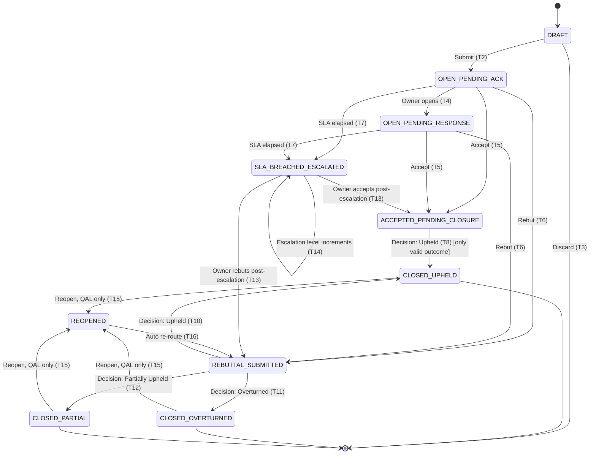

# Workflow / State Machine Specification
## QEMS — Quality Error Management System

| Field | Value |
|---|---|
| Document Version | 1.0 |
| Depends On | PRD v1.0, FSD v1.0, FRS v1.0, RBAC Matrix v1.0 |

---

## 1. State Inventory

| Code | State | Terminal? |
|---|---|---|
| S0 | `DRAFT` | No |
| S1 | `OPEN_PENDING_ACK` | No |
| S2 | `OPEN_PENDING_RESPONSE` | No |
| S3 | `ACCEPTED_PENDING_CLOSURE` | No |
| S4 | `REBUTTAL_SUBMITTED_PENDING_QA_REVIEW` | No |
| S5 | `SLA_BREACHED_ESCALATED` | No (overlay state — see §4) |
| S6 | `CLOSED_UPHELD` | Yes (soft) |
| S7 | `CLOSED_OVERTURNED` | Yes (soft) |
| S8 | `CLOSED_PARTIAL` | Yes (soft) |
| S9 | `REOPENED` | No |

"Soft terminal" = no forward transition exists except the explicit, permissioned, audit-logged `Reopen` action, which routes back into the workflow (§3.9).

---

## 2. Full Transition Table

| # | From | Event / Action | Actor | Guard Condition(s) | To | Notification(s) Fired |
|---|---|---|---|---|---|---|
| T1 | — (new) | Start logging | AUD | — | S0 `DRAFT` | none |
| T2 | S0 | Submit | AUD | All mandatory fields valid; evidence rule satisfied if severity Critical/High | S1 `OPEN_PENDING_ACK` | NT-01 |
| T3 | S0 | Discard draft | AUD | — | (deleted — draft only, never counted in reporting) | none |
| T4 | S1 | Owner opens/views record | OPS_AGT / OPS_MGR | — | S2 `OPEN_PENDING_RESPONSE` | NT-02 (to AUD only) |
| T5 | S1 or S2 | Owner selects Accept | OPS_AGT / OPS_MGR | — | S3 `ACCEPTED_PENDING_CLOSURE` | NT-04 |
| T6 | S1 or S2 | Owner selects Rebut | OPS_AGT / OPS_MGR | Justification ≥ 20 chars; not identical to original description | S4 `REBUTTAL_SUBMITTED_PENDING_QA_REVIEW` | NT-03 |
| T7 | S1 or S2 | SLA window elapses with no owner action | System (SLA Engine) | Elapsed time ≥ 100% of configured SLA window | S5 `SLA_BREACHED_ESCALATED` | NT-05, NT-07 |
| T8 | S3 | QA records decision = Upheld | AUD / QAL | Rationale ≥ 20 chars | S6 `CLOSED_UPHELD` | NT-06 |
| T9 | S3 | QA attempts decision = Overturned or Partial | AUD / QAL | **Blocked** — not a valid transition; system rejects | (no transition — validation error, FR-06-003) | none |
| T10 | S4 | QA records decision = Upheld | AUD / QAL | Rationale ≥ 20 chars | S6 `CLOSED_UPHELD` | NT-06 |
| T11 | S4 | QA records decision = Overturned | AUD / QAL | Rationale ≥ 20 chars | S7 `CLOSED_OVERTURNED` | NT-06 |
| T12 | S4 | QA records decision = Partially Upheld | AUD / QAL | Rationale ≥ 20 chars + upheld/conceded breakdown | S8 `CLOSED_PARTIAL` | NT-06 |
| T13 | S5 | Owner takes action (Accept/Rebut) post-escalation | OPS_AGT / OPS_MGR | Same guards as T5/T6 | S3 or S4 (per action taken) | NT-04 or NT-03 (escalation-path recipients remain CC'd until this point per BR-9.3) |
| T14 | S5 | Escalation threshold N reached, still no action | System (Escalation Engine) | Elapsed time ≥ Level-N threshold per Admin config | S5 (remains, escalation level increments internally) | NT-07 (to next escalation level) |
| T15 | S6, S7, or S8 | Reopen (correction/renegotiation) | QAL only | Mandatory reason text; QAL role required (FR-06-006) | S9 `REOPENED` | NT-08 |
| T16 | S9 | System routes reopened record back into workflow | System | Automatic, immediately following T15 | S4 `REBUTTAL_SUBMITTED_PENDING_QA_REVIEW` (default re-entry point — reopens for renegotiation of the decision) | NT-08 (already sent at T15; no duplicate) |
| T17 | S2 | Owner reopens rebuttal at auditor's request pre-decision (correction to a submitted rebuttal) | AUD / QAL initiates; system unlocks | Explicit "Allow rebuttal correction" action by AUD/QAL, logged reason | S1 or S2 (rebuttal field re-opened for owner edit once) | none (internal correction; optional notification to owner) |

---

## 3. Transition Narrative & Business Rules per State

### 3.1 `DRAFT` (S0)
- Visible only to the creating auditor.
- Never appears in dashboards, SLA calculations, or reports.
- No notification fires until T2 (Submit).

### 3.2 `OPEN_PENDING_ACK` (S1)
- Entry action: QA Error ID generated (M3), ownership resolved (M4), NT-01 dispatched.
- SLA clock starts at the moment of entry into S1 (not at T4).
- Guard on exit to S5 (T7): purely time-based, evaluated continuously by the SLA Engine (not by user action).

### 3.3 `OPEN_PENDING_RESPONSE` (S2)
- Entered when the owner first opens the record (T4) — this transition exists purely for visibility/tracking (e.g., "owner has seen this but not yet responded") and does not reset or pause the SLA clock.
- SLA clock continues uninterrupted from S1 through S2 into S5 if unresolved.

### 3.4 `ACCEPTED_PENDING_CLOSURE` (S3)
- Only decision permitted from this state (per FR-06-003 / T8 vs T9) is **Upheld**.
- Rationale: since the owner accepted the finding as valid, "Overturned" from this state would be logically inconsistent without a Reopen first (which would move the record to a fresh rebuttal cycle, S4, where Overturned becomes valid again).

### 3.5 `REBUTTAL_SUBMITTED_PENDING_QA_REVIEW` (S4)
- Only state from which all three decision outcomes (Upheld/Overturned/Partial) are valid (T10/T11/T12).
- Evidence from both auditor (original) and owner (rebuttal) is visible to the deciding QA role at this stage.

### 3.6 `SLA_BREACHED_ESCALATED` (S5)
- This is modeled as an **overlay state**: it does not remove the record from its underlying rebuttal-pending status conceptually, but the *displayed* and *reported* status is `SLA_BREACHED_ESCALATED` until owner action occurs.
- Internally, the system retains which underlying stage the breach occurred in (pending-acknowledgement vs. pending-response) so that when the owner finally acts (T13), the correct next state (S3 or S4) is determined by the action taken, not by which sub-stage the breach originated from.
- Escalation levels increment via T14 without leaving S5; each level increment fires NT-07 to the next configured recipient tier (per FSD §11 / Admin-configured Escalation Matrix).

### 3.7 `CLOSED_UPHELD` / `CLOSED_OVERTURNED` / `CLOSED_PARTIAL` (S6/S7/S8)
- Read-only to all roles except the Reopen action (QAL only).
- These are "soft terminal" — no forward transition except T15.

### 3.8 `REOPENED` (S9)
- Transient state: system immediately re-routes (T16) into S4 for renegotiation.
- The original decision, rationale, and full closure history remain permanently visible in the audit trail (History tab) — reopening does not erase or hide the prior decision; it appends a new cycle on top of it.
- A record can be reopened multiple times; each reopen is a distinct, separately logged event (no limit on reopen count in Phase 1, though QA Leadership may add a soft policy limit administratively — not a system-enforced constraint).

### 3.9 Rebuttal Correction Path (T17)
- Distinct from Reopen (T15): this is a narrower, pre-decision correction allowing the owner to fix/resubmit a rebuttal that was submitted in error, at the discretion of the QA Auditor/Lead, without going through a full close-and-reopen cycle.
- Logged as its own audit event, separate from T15/T16.

---

## 4. Mermaid State Diagram (for rendering in any Mermaid-compatible viewer)

*(Note: `REBUTTAL_SUBMITTED` in the diagram = `REBUTTAL_SUBMITTED_PENDING_QA_REVIEW` shortened for diagram readability.)*

---

## 5. Guard Condition Summary Table (Quick Reference)

| Transition | Guard |
|---|---|
| T2 (Submit) | All mandatory fields valid + evidence rule if Critical/High |
| T6 (Rebut) | Justification ≥ 20 chars, not identical to original description |
| T7 (SLA breach) | Elapsed ≥ 100% of configured SLA window |
| T8/T10/T11/T12 (Decision) | Rationale ≥ 20 chars (Partial also requires breakdown) |
| T9 (blocked) | Overturned/Partial attempted from Accepted state — always rejected |
| T15 (Reopen) | Actor role = QAL; mandatory reason text |

---

## 6. Illegal Transition Handling

- Any transition attempted outside the table above (e.g., Operations Agent attempting to record a QA decision, or a decision attempted twice on an already-closed record without Reopen) must be rejected at the **API layer** with an explicit error — never silently ignored, and never allowed to "succeed" at the UI layer only to fail invisibly.
- All rejected transition attempts are themselves logged (actor, attempted transition, reason for rejection) to support security/audit review — this is in addition to, not a replacement for, the standard audit trail of successful transitions.

---

*End of Workflow/State Machine document. Next document: Database Schema (ER Diagram + Tables).*
