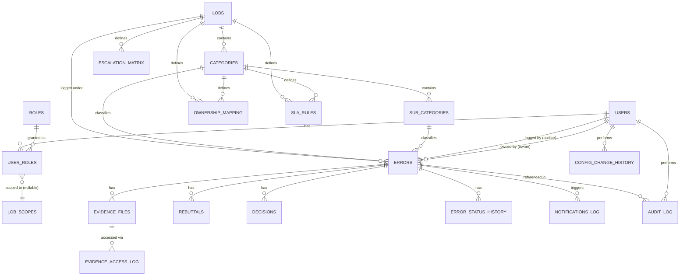

# Database Schema Design
## QEMS — Quality Error Management System (PostgreSQL)

| Field | Value |
|---|---|
| Document Version | 1.0 |
| Target Engine | PostgreSQL 15+ |
| Depends On | PRD, FSD, FRS, NFRS, RBAC Matrix, Workflow/State Machine |
| Conventions | UUID primary keys (`gen_random_uuid()`) for business entities; `BIGSERIAL` for high-volume append-only log tables; all timestamps `TIMESTAMPTZ`; `snake_case` naming |

---

## 1. Entity-Relationship Diagram (Mermaid)

---

## 2. Table Definitions

### 2.1 `users`

| Column | Type | Constraints | Notes |
|---|---|---|---|
| id | UUID | PK, default `gen_random_uuid()` | |
| sso_subject_id | VARCHAR(255) | UNIQUE, NOT NULL | Identity provider's subject/NameID |
| employee_id | VARCHAR(50) | UNIQUE, NULL | Optional enterprise HRIS reference |
| full_name | VARCHAR(200) | NOT NULL | |
| email | VARCHAR(255) | UNIQUE, NOT NULL | |
| is_active | BOOLEAN | NOT NULL, DEFAULT true | Deactivation flag (FR-01-004) |
| created_at | TIMESTAMPTZ | NOT NULL, DEFAULT now() | |
| updated_at | TIMESTAMPTZ | NOT NULL, DEFAULT now() | |
| last_login_at | TIMESTAMPTZ | NULL | |

Indexes: `idx_users_email`, `idx_users_sso_subject_id` (both unique, auto from constraint), `idx_users_is_active`.

### 2.2 `roles`

| Column | Type | Constraints | Notes |
|---|---|---|---|
| id | UUID | PK, default `gen_random_uuid()` | |
| code | VARCHAR(30) | UNIQUE, NOT NULL | e.g., `AUD`, `QAL`, `OPS_AGT`, `OPS_MGR`, `QA_GOV`, `ADMIN`, `AUDITOR_RO`, `UNASSIGNED` |
| name | VARCHAR(100) | NOT NULL | Display name |
| description | TEXT | NULL | |

Seed data: the 8 roles from the RBAC Matrix, inserted at migration time (not user-creatable in Phase 1 — role set is fixed by design/schema, not admin-extensible, to keep RBAC logic deterministic).

### 2.3 `lobs`

| Column | Type | Constraints | Notes |
|---|---|---|---|
| id | UUID | PK, default `gen_random_uuid()` | |
| code | VARCHAR(10) | UNIQUE, NOT NULL | Used in QA Error ID (FSD §5.1) |
| name | VARCHAR(150) | NOT NULL | |
| is_active | BOOLEAN | NOT NULL, DEFAULT true | Deactivating an LOB does not affect historical errors (FR-02-008) |
| created_at | TIMESTAMPTZ | NOT NULL, DEFAULT now() | |

### 2.4 `user_roles`

| Column | Type | Constraints | Notes |
|---|---|---|---|
| id | UUID | PK, default `gen_random_uuid()` | |
| user_id | UUID | FK → users(id), NOT NULL | |
| role_id | UUID | FK → roles(id), NOT NULL | |
| lob_id | UUID | FK → lobs(id), NULL | NULL = cross-LOB scope (only valid for QA_GOV, ADMIN, AUDITOR_RO per RBAC rules; application-layer validation enforces this, not a DB constraint, to keep schema simple) |
| assigned_by | UUID | FK → users(id), NOT NULL | Admin who made the assignment |
| assigned_at | TIMESTAMPTZ | NOT NULL, DEFAULT now() | |
| revoked_at | TIMESTAMPTZ | NULL | Soft-revoke; NULL = active |

Indexes: `idx_user_roles_user_id`, `idx_user_roles_role_lob` (role_id, lob_id).
Unique constraint: `(user_id, role_id, lob_id)` where `revoked_at IS NULL` (partial unique index) — prevents duplicate active assignment.

### 2.5 `categories`

| Column | Type | Constraints | Notes |
|---|---|---|---|
| id | UUID | PK, default `gen_random_uuid()` | |
| lob_id | UUID | FK → lobs(id), NOT NULL | |
| name | VARCHAR(150) | NOT NULL | |
| is_active | BOOLEAN | NOT NULL, DEFAULT true | |
| requires_evidence_at_severity | VARCHAR(20)[] | DEFAULT `'{CRITICAL,HIGH}'` | Admin-configurable per category (FSD §15.1) |
| created_at | TIMESTAMPTZ | NOT NULL, DEFAULT now() | |

Unique constraint: `(lob_id, name)`.

### 2.6 `sub_categories`

| Column | Type | Constraints | Notes |
|---|---|---|---|
| id | UUID | PK, default `gen_random_uuid()` | |
| category_id | UUID | FK → categories(id), NOT NULL | |
| name | VARCHAR(150) | NOT NULL | |
| is_active | BOOLEAN | NOT NULL, DEFAULT true | |

Unique constraint: `(category_id, name)`.

### 2.7 `ownership_mapping`

| Column | Type | Constraints | Notes |
|---|---|---|---|
| id | UUID | PK, default `gen_random_uuid()` | |
| lob_id | UUID | FK → lobs(id), NOT NULL | |
| category_id | UUID | FK → categories(id), NOT NULL | |
| default_owner_role_id | UUID | FK → roles(id), NOT NULL | Typically `OPS_AGT` or `OPS_MGR` team queue |
| default_owner_team_ref | VARCHAR(150) | NOT NULL | Team/queue identifier (references an operations team grouping; Phase 1 models this as a label + the manager user below) |
| default_owner_manager_user_id | UUID | FK → users(id), NULL | Used for CC on notification (FSD §6.2) |
| effective_from | TIMESTAMPTZ | NOT NULL, DEFAULT now() | Supports config versioning (FR-13-002) |
| effective_to | TIMESTAMPTZ | NULL | NULL = currently active |
| created_by | UUID | FK → users(id), NOT NULL | |

Unique partial index: `(lob_id, category_id)` where `effective_to IS NULL` — enforces one active mapping per (LOB, Category), per the locked assumption.

### 2.8 `sla_rules`

| Column | Type | Constraints | Notes |
|---|---|---|---|
| id | UUID | PK, default `gen_random_uuid()` | |
| lob_id | UUID | FK → lobs(id), NOT NULL | |
| category_id | UUID | FK → categories(id), NULL | NULL = LOB-wide default |
| severity | VARCHAR(20) | NOT NULL, CHECK IN ('CRITICAL','HIGH','MEDIUM','LOW') | |
| rebuttal_window_hours | INTEGER | NOT NULL | Business hours, per FSD §10.2 |
| decision_window_hours | INTEGER | NOT NULL | |
| effective_from | TIMESTAMPTZ | NOT NULL, DEFAULT now() | |
| effective_to | TIMESTAMPTZ | NULL | |
| created_by | UUID | FK → users(id), NOT NULL | |

Unique partial index: `(lob_id, category_id, severity)` where `effective_to IS NULL`.
**Business rule (FR-13-004):** an error's applicable SLA rule is captured by value (denormalized onto the `errors` row at creation time — see §2.9, `sla_rebuttal_window_hours_snapshot`) so later config changes never retroactively affect an already-open error.

### 2.9 `errors` (core entity)

| Column | Type | Constraints | Notes |
|---|---|---|---|
| id | UUID | PK, default `gen_random_uuid()` | Internal PK |
| qa_error_id | VARCHAR(30) | UNIQUE, NOT NULL | Human-facing ID (FSD §5.1), e.g. `QE-BILL-2026-000481` |
| lob_id | UUID | FK → lobs(id), NOT NULL | |
| category_id | UUID | FK → categories(id), NOT NULL | |
| sub_category_id | UUID | FK → sub_categories(id), NULL | |
| severity | VARCHAR(20) | NOT NULL, CHECK IN ('CRITICAL','HIGH','MEDIUM','LOW') | |
| status | VARCHAR(40) | NOT NULL | One of the 10 states in Workflow/State Machine §1 |
| transaction_reference | VARCHAR(50) | NOT NULL | |
| logged_by_user_id | UUID | FK → users(id), NOT NULL | The auditor |
| owner_user_id | UUID | FK → users(id), NULL | Resolved individual owner, if applicable |
| owner_team_ref | VARCHAR(150) | NULL | Resolved team queue, if no individual owner |
| owner_manager_user_id | UUID | FK → users(id), NULL | CC recipient, from ownership_mapping snapshot |
| date_of_occurrence | DATE | NOT NULL, CHECK (<= CURRENT_DATE) | |
| date_of_detection | DATE | NOT NULL | |
| description | TEXT | NOT NULL, CHECK (char_length(description) >= 20) | |
| initial_root_cause | VARCHAR(150) | NULL | |
| internal_notes | TEXT | NULL | QA-only, field-level access controlled at API layer |
| client_impact_flag | BOOLEAN | NOT NULL, DEFAULT false | |
| is_self_flagged | BOOLEAN | NOT NULL, DEFAULT false | FR-02-009 |
| sla_rebuttal_window_hours_snapshot | INTEGER | NOT NULL | Locked at creation (FR-13-004) |
| sla_decision_window_hours_snapshot | INTEGER | NOT NULL | Locked at creation |
| sla_clock_started_at | TIMESTAMPTZ | NULL | Set on entering `OPEN_PENDING_ACK` |
| current_escalation_level | INTEGER | NOT NULL, DEFAULT 0 | 0 = not escalated |
| idempotency_key | VARCHAR(100) | UNIQUE, NULL | FR-02-007 |
| is_draft | BOOLEAN | NOT NULL, DEFAULT false | |
| created_at | TIMESTAMPTZ | NOT NULL, DEFAULT now() | |
| updated_at | TIMESTAMPTZ | NOT NULL, DEFAULT now() | |
| submitted_at | TIMESTAMPTZ | NULL | When draft → submitted (T2) |
| closed_at | TIMESTAMPTZ | NULL | |

Indexes: `idx_errors_qa_error_id` (unique), `idx_errors_status`, `idx_errors_lob_category`, `idx_errors_owner_user_id`, `idx_errors_logged_by`, `idx_errors_created_at` (for date-range dashboard queries), `idx_errors_sla_clock` (partial index on non-terminal statuses, for the SLA engine's polling query).

### 2.10 `error_status_history`

| Column | Type | Constraints | Notes |
|---|---|---|---|
| id | BIGSERIAL | PK | High-volume append-only |
| error_id | UUID | FK → errors(id), NOT NULL | |
| from_status | VARCHAR(40) | NULL | NULL for initial creation |
| to_status | VARCHAR(40) | NOT NULL | |
| transition_code | VARCHAR(10) | NOT NULL | References T1–T17 from Workflow doc |
| performed_by_user_id | UUID | FK → users(id), NULL | NULL for system-triggered transitions (e.g., T7 SLA breach) |
| performed_by_system | BOOLEAN | NOT NULL, DEFAULT false | |
| reason | TEXT | NULL | Populated for Reopen (T15) and rejected-correction paths |
| occurred_at | TIMESTAMPTZ | NOT NULL, DEFAULT now() | |

Index: `idx_error_status_history_error_id` (error_id, occurred_at).

### 2.11 `rebuttals`

| Column | Type | Constraints | Notes |
|---|---|---|---|
| id | UUID | PK, default `gen_random_uuid()` | |
| error_id | UUID | FK → errors(id), NOT NULL | |
| submitted_by_user_id | UUID | FK → users(id), NOT NULL | |
| justification | TEXT | NOT NULL, CHECK (char_length(justification) >= 20) | |
| cycle_number | INTEGER | NOT NULL, DEFAULT 1 | Increments on each Reopen-driven renegotiation cycle |
| submitted_at | TIMESTAMPTZ | NOT NULL, DEFAULT now() | |
| is_correction_of_rebuttal_id | UUID | FK → rebuttals(id), NULL | Self-reference for T17 correction path |

Index: `idx_rebuttals_error_id`.

### 2.12 `decisions`

| Column | Type | Constraints | Notes |
|---|---|---|---|
| id | UUID | PK, default `gen_random_uuid()` | |
| error_id | UUID | FK → errors(id), NOT NULL | |
| decided_by_user_id | UUID | FK → users(id), NOT NULL | |
| decision | VARCHAR(20) | NOT NULL, CHECK IN ('UPHELD','OVERTURNED','PARTIALLY_UPHELD') | |
| rationale | TEXT | NOT NULL, CHECK (char_length(rationale) >= 20) | |
| partial_breakdown | TEXT | NULL | Required at application layer when decision = PARTIALLY_UPHELD |
| cycle_number | INTEGER | NOT NULL, DEFAULT 1 | Matches the rebuttal cycle it resolves |
| decided_at | TIMESTAMPTZ | NOT NULL, DEFAULT now() | |

Index: `idx_decisions_error_id`.

### 2.13 `evidence_files`

| Column | Type | Constraints | Notes |
|---|---|---|---|
| id | UUID | PK, default `gen_random_uuid()` | |
| error_id | UUID | FK → errors(id), NOT NULL | |
| uploaded_by_user_id | UUID | FK → users(id), NOT NULL | |
| stage | VARCHAR(30) | NOT NULL, CHECK IN ('ORIGINAL_LOGGING','REBUTTAL','DECISION') | |
| file_name | VARCHAR(255) | NOT NULL | |
| file_type | VARCHAR(20) | NOT NULL | |
| file_size_bytes | BIGINT | NOT NULL | |
| storage_uri | VARCHAR(500) | NOT NULL | Blob storage reference, not the binary itself |
| checksum_sha256 | VARCHAR(64) | NOT NULL | |
| is_current_version | BOOLEAN | NOT NULL, DEFAULT true | |
| supersedes_evidence_id | UUID | FK → evidence_files(id), NULL | Self-reference for versioning (FR-07-004) |
| malware_scan_status | VARCHAR(20) | NOT NULL, DEFAULT 'PENDING', CHECK IN ('PENDING','CLEAN','INFECTED','FAILED') | NFR-SEC-05 |
| uploaded_at | TIMESTAMPTZ | NOT NULL, DEFAULT now() | |

Index: `idx_evidence_files_error_id`.
**No DELETE is exposed at the application layer** (FR-07-004) — enforced via API design and, defensively, via a `REVOKE DELETE` on the application's database role for this table in production.

### 2.14 `evidence_access_log`

| Column | Type | Constraints | Notes |
|---|---|---|---|
| id | BIGSERIAL | PK | |
| evidence_id | UUID | FK → evidence_files(id), NOT NULL | |
| accessed_by_user_id | UUID | FK → users(id), NOT NULL | |
| action | VARCHAR(10) | NOT NULL, CHECK IN ('VIEW','DOWNLOAD') | |
| accessed_at | TIMESTAMPTZ | NOT NULL, DEFAULT now() | |

Index: `idx_evidence_access_log_evidence_id`.

### 2.15 `escalation_matrix`

| Column | Type | Constraints | Notes |
|---|---|---|---|
| id | UUID | PK, default `gen_random_uuid()` | |
| lob_id | UUID | FK → lobs(id), NOT NULL | |
| escalation_level | INTEGER | NOT NULL | 1, 2, 3... |
| threshold_hours_after_breach | INTEGER | NOT NULL | Additional hours after initial breach before this level fires |
| recipient_role_id | UUID | FK → roles(id), NULL | e.g., escalate to QAL |
| recipient_user_id | UUID | FK → users(id), NULL | Specific override recipient, if configured |
| effective_from | TIMESTAMPTZ | NOT NULL, DEFAULT now() | |
| effective_to | TIMESTAMPTZ | NULL | |

Unique partial index: `(lob_id, escalation_level)` where `effective_to IS NULL`.

### 2.16 `notification_templates`

| Column | Type | Constraints | Notes |
|---|---|---|---|
| id | UUID | PK, default `gen_random_uuid()` | |
| code | VARCHAR(10) | UNIQUE, NOT NULL | NT-01 ... NT-08 |
| subject_template | VARCHAR(500) | NOT NULL | |
| body_template | TEXT | NOT NULL | Contains `{Token}` placeholders per FSD §17 |
| is_active | BOOLEAN | NOT NULL, DEFAULT true | |
| version | INTEGER | NOT NULL, DEFAULT 1 | |
| updated_by | UUID | FK → users(id), NOT NULL | |
| updated_at | TIMESTAMPTZ | NOT NULL, DEFAULT now() | |

### 2.17 `notifications_log`

| Column | Type | Constraints | Notes |
|---|---|---|---|
| id | BIGSERIAL | PK | High volume |
| error_id | UUID | FK → errors(id), NOT NULL | |
| template_code | VARCHAR(10) | NOT NULL | |
| channel | VARCHAR(10) | NOT NULL, CHECK IN ('EMAIL','IN_APP') | |
| recipient_user_id | UUID | FK → users(id), NOT NULL | |
| status | VARCHAR(20) | NOT NULL, CHECK IN ('QUEUED','SENT','DELIVERED','FAILED','BOUNCED') | |
| failure_reason | TEXT | NULL | |
| dispatched_at | TIMESTAMPTZ | NULL | |
| created_at | TIMESTAMPTZ | NOT NULL, DEFAULT now() | |

Index: `idx_notifications_log_error_id`, `idx_notifications_log_status` (for the retry/failure-alert job).

### 2.18 `in_app_notifications`

| Column | Type | Constraints | Notes |
|---|---|---|---|
| id | UUID | PK, default `gen_random_uuid()` | |
| user_id | UUID | FK → users(id), NOT NULL | |
| error_id | UUID | FK → errors(id), NOT NULL | |
| message | VARCHAR(500) | NOT NULL | |
| is_read | BOOLEAN | NOT NULL, DEFAULT false | |
| created_at | TIMESTAMPTZ | NOT NULL, DEFAULT now() | |

Index: `idx_in_app_notifications_user_id` (user_id, is_read).

### 2.19 `audit_log` (general system-wide audit, distinct from `error_status_history`)

| Column | Type | Constraints | Notes |
|---|---|---|---|
| id | BIGSERIAL | PK | Append-only, no update/delete at application layer |
| entity_type | VARCHAR(50) | NOT NULL | e.g., 'ERROR','EVIDENCE','USER_ROLE','CONFIG' |
| entity_id | UUID | NOT NULL | Polymorphic reference |
| action | VARCHAR(50) | NOT NULL | e.g., 'CREATE','VIEW','EXPORT','ROLE_ASSIGN' |
| performed_by_user_id | UUID | FK → users(id), NULL | |
| metadata | JSONB | NULL | Flexible extra context (e.g., export filter params) |
| occurred_at | TIMESTAMPTZ | NOT NULL, DEFAULT now() | |

Index: `idx_audit_log_entity` (entity_type, entity_id), `idx_audit_log_occurred_at`.

### 2.20 `config_change_history`

| Column | Type | Constraints | Notes |
|---|---|---|---|
| id | BIGSERIAL | PK | |
| config_entity | VARCHAR(50) | NOT NULL | e.g., 'SLA_RULE','OWNERSHIP_MAPPING','ESCALATION_MATRIX' |
| entity_id | UUID | NOT NULL | |
| old_value | JSONB | NULL | |
| new_value | JSONB | NOT NULL | |
| changed_by_user_id | UUID | FK → users(id), NOT NULL | |
| changed_at | TIMESTAMPTZ | NOT NULL, DEFAULT now() | |

### 2.21 `working_hours_calendar`

| Column | Type | Constraints | Notes |
|---|---|---|---|
| id | UUID | PK, default `gen_random_uuid()` | |
| region_code | VARCHAR(10) | NOT NULL | |
| business_start_time | TIME | NOT NULL | |
| business_end_time | TIME | NOT NULL | |
| business_days_of_week | INTEGER[] | NOT NULL | e.g., `{1,2,3,4,5}` (Mon–Fri) |

### 2.22 `holidays`

| Column | Type | Constraints | Notes |
|---|---|---|---|
| id | UUID | PK, default `gen_random_uuid()` | |
| region_code | VARCHAR(10) | NOT NULL | |
| holiday_date | DATE | NOT NULL | |
| description | VARCHAR(150) | NULL | |

Unique constraint: `(region_code, holiday_date)`.

---

## 3. Key Design Decisions & Rationale

| Decision | Rationale |
|---|---|
| SLA windows snapshotted onto `errors` at creation | Satisfies FR-13-004 (no retroactive SLA changes) without complex point-in-time joins on every aging calculation |
| Config tables use `effective_from`/`effective_to` versioning instead of update-in-place | Satisfies FR-13-002 (full config change history) while keeping "current value" queries simple (`WHERE effective_to IS NULL`) |
| `error_status_history` and `audit_log` are separate tables | `error_status_history` is a structured, narrowly-typed transition log used directly by the SLA/reporting engine; `audit_log` is a general-purpose, polymorphic log for compliance/security review across all entity types. Separating them keeps the hot-path transition table lean and fast to query. |
| Evidence versioning via self-referencing `supersedes_evidence_id` rather than in-place update | Satisfies FR-07-004 (never overwrite/delete); every version remains independently queryable |
| No `DELETE` grants on `audit_log`, `error_status_history`, `evidence_files`, `notifications_log` for the application's DB role | Defense-in-depth for NFR-AUD-02 (tamper-evidence) — even a bug or compromised application credential cannot silently erase history at the database level |
| Roles are a fixed seed table, not admin-creatable | Keeps RBAC permission logic (hardcoded per role in the API layer) deterministic and testable; adding a genuinely new role is a controlled schema/code change, not a runtime config change |

---

## 4. Capacity Projection (supports NFR-SCALE-04)

| Table | Est. rows/year (at upper-bound 800 errors/day) | 5-year projection |
|---|---|---|
| errors | ~292,000 | ~1.46M |
| error_status_history | ~5–8 per error → ~2M | ~10M |
| evidence_files | ~1.5 per error → ~438,000 | ~2.19M |
| notifications_log | ~4–6 per error → ~1.5M | ~7.5M |
| audit_log | ~10+ per error → ~3M | ~15M |

All projected volumes are comfortably within standard PostgreSQL performance envelopes given the indexing strategy above; no partitioning is required at Phase 1 launch, but `error_status_history`, `notifications_log`, and `audit_log` should be **designed with future range-partitioning by `occurred_at`/`created_at` in mind** (e.g., avoid patterns that would block later conversion to a partitioned table) given their growth rate relative to `errors`.

---

*End of Database Schema document. Next document: REST API Design.*
