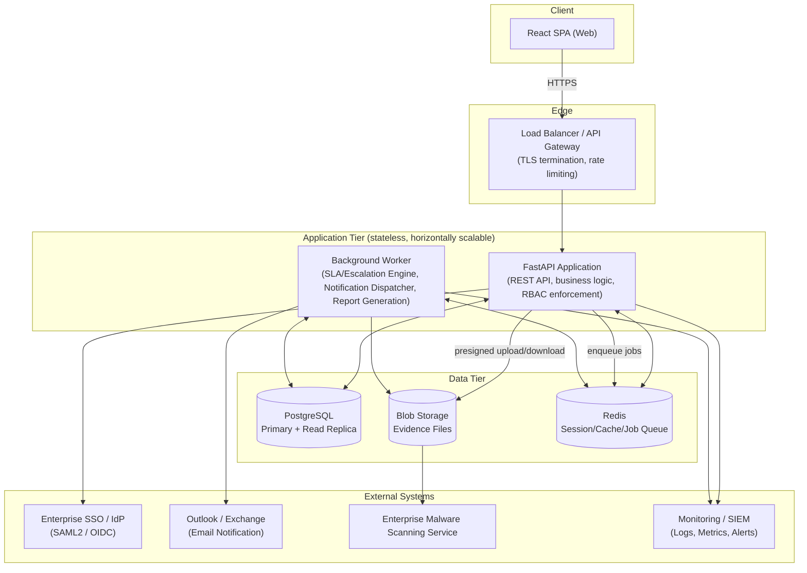
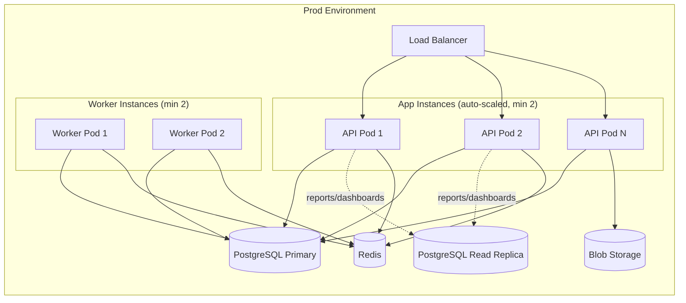

# System Architecture
## QEMS — Quality Error Management System

| Field | Value |
|---|---|
| Document Version | 1.0 |
| Depends On | All prior documents (PRD → REST API Design) |
| Stack | React (frontend) + Python FastAPI (backend) + PostgreSQL (database) + Blob Storage (evidence) |

---

## 1. Architecture Style

QEMS Phase 1 is built as a **modular monolith** (not microservices) exposed through a single versioned REST API, with clearly separated internal service boundaries (per FSD §16 / API Design §8) so that specific modules — particularly the AI-readiness services — can later be extracted into independent services without a full rewrite.

Rationale: at the documented Phase 1 scale (≤ ~800 errors/day, ≤ ~300 concurrent sessions), a microservices split would add operational overhead (service discovery, distributed tracing, network latency between services) without a corresponding benefit. The modular monolith gets production-grade separation of concerns in code while keeping deployment, transaction management (ACID across error+evidence+notification writes), and operational complexity low. The internal service-interface pattern (§8 of API Design) preserves the option to extract services later if scale or team structure demands it.

---

## 2. High-Level Component Diagram

---

## 3. Component Responsibilities

### 3.1 React SPA (Frontend)
- Single-page application; role-aware routing (renders Auditor/QAL/Ops/Leadership/Admin views based on `/auth/me` response).
- Talks exclusively to the FastAPI REST API — no direct database or storage access.
- Responsible for client-side validation (fast feedback) but never the source of truth — all validation is re-enforced server-side (NFR-SEC-04).
- Handles file upload via direct-to-API multipart (Phase 1) or presigned-URL-to-blob-storage pattern (recommended for large-file efficiency at scale — see §6).

### 3.2 Load Balancer / API Gateway
- TLS termination (NFR-SEC-02).
- Rate limiting enforcement (API Design §9).
- Routes to healthy API tier instances only (health-check integration, NFR-MON-01).

### 3.3 FastAPI Application (API Tier)
- Stateless — no in-memory session state, enabling horizontal scaling (NFR-SCALE-03).
- Layers within the application:
  - **Route/Controller layer** — request/response schema validation (Pydantic), RBAC guard decorators.
  - **Service layer** — business logic per FSD module (error logging, rebuttal, decision, ownership resolution, SLA calculation helpers, extensibility service interfaces).
  - **Repository/data-access layer** — SQLAlchemy (or equivalent) models mapping to the schema in the Database Schema document; all writes to append-only tables (`audit_log`, `error_status_history`, `evidence_files`, `notifications_log`) go through repository methods that never expose update/delete.
- Synchronous request/response for all user-facing actions (logging, rebuttal, decision, evidence upload metadata) — kept fast per NFRS targets by offloading slow work (notification dispatch, report generation, malware scan) to the background worker via the job queue.

### 3.4 Background Worker
- Consumes jobs from the Redis-backed queue (e.g., using Celery or an equivalent Python task queue).
- **SLA/Escalation Engine:** runs on a short polling interval (e.g., every 60 seconds) evaluating `errors` rows against their SLA snapshot to trigger T7 (breach) and T14 (escalation-level increment) transitions — satisfies NFR-PERF-05 (≤5 min detection latency) with comfortable margin.
- **Notification Dispatcher:** consumes notification jobs enqueued by the API tier on every trigger event (T2, T4, T6, T7, decision, T14, T15), renders the appropriate template (from `notification_templates`), sends via SMTP relay to Outlook/Exchange, and records delivery status in `notifications_log` (updated further by the async delivery-status webhook).
- **Report Generation:** handles `/reports/export` jobs asynchronously for large exports, notifying the user (in-app) when the signed download URL is ready — synchronous for small/fast exports, asynchronous fallback for large ones.

### 3.5 PostgreSQL (Primary + Read Replica)
- Primary handles all writes.
- Read replica serves dashboard/reporting queries (M10) to isolate analytical read load from the transactional write path — protects NFR-PERF targets for core workflow actions even during heavy dashboard usage (e.g., before a QBR).
- Automated backups + point-in-time recovery configured to meet NFR-AVAIL-04 (RPO ≤ 15 min).

### 3.6 Blob Storage
- Stores evidence file binaries; database stores only metadata + URI (Database Schema §2.13).
- Lifecycle policies enforce retention rules (NFR-DATA-01) and support legal-hold override (NFR-DATA-03).
- Files pass through malware scanning before `malware_scan_status` flips to `CLEAN` and download becomes permitted.

### 3.7 Redis (Cache / Session / Job Queue)
- Backs the background job queue (Celery broker or equivalent).
- Caches frequently-read, slow-changing config (LOBs, categories, SLA rules, ownership mapping) to reduce database load on the hot path of error creation — cache invalidated on any Admin config write (via the shared config-change middleware noted in API Design §7).
- Optionally caches JWT validation/session lookups if the auth pattern requires server-side session state beyond stateless JWT.

### 3.8 External Systems
- **Enterprise SSO/IdP:** SAML2/OIDC identity provider; QEMS never stores passwords (NFR-SEC-01).
- **Outlook/Exchange:** Phase 1's sole notification channel, per PRD decision; architecture keeps the Notification Dispatcher's channel logic abstracted (a `NotificationChannel` interface) so Teams/Slack could be added later (Phase 3 candidate) without redesigning the dispatcher.
- **Malware Scanning Service:** enterprise-provided; integrated via async callback (API Design §10).
- **Monitoring/SIEM:** receives structured logs, metrics, and security events from both API and Worker tiers (NFR-MAINT-04, NFR-SEC-06, NFR-MON-01/02/03).

---

## 4. Deployment View

- Containerized deployment (Docker), orchestrated via Kubernetes or equivalent managed container platform — satisfies NFR-SCALE-03 (horizontal scaling) and NFR-ENV-02 (blue-green/rolling deployment, near-zero downtime).
- Minimum 2 replicas each for API and Worker tiers in production for availability (NFR-AVAIL-01/03).
- Three environments (Dev, UAT/Staging, Prod) per NFR-ENV-01, each with isolated database, blob storage container/bucket, and configuration.

---

## 5. Security Architecture Summary

| Layer | Control |
|---|---|
| Transport | TLS 1.2+ everywhere (client↔LB, LB↔API, API↔DB where supported) — NFR-SEC-02 |
| Authentication | SSO/OIDC only; JWT bearer tokens, short-lived + refresh token pattern — NFR-SEC-01, NFR-SEC-07 |
| Authorization | RBAC enforced at API route/service layer, independent of UI — NFR-SEC-04, NFR-SEC-09 |
| Data at rest | AES-256 encryption on PostgreSQL and Blob Storage — NFR-SEC-03 |
| Field-level protection | `internal_notes` and similar sensitive fields excluded from API responses at the serialization layer for unauthorized roles, not just hidden in UI — NFR-SEC-10 |
| File safety | Mandatory malware scan before evidence becomes downloadable — NFR-SEC-05 |
| Auditability | Append-only audit tables with no application-exposed delete/update; DB-role-level `REVOKE DELETE` as defense-in-depth — NFR-AUD-02 |
| Monitoring | Auth events, admin actions, and rejected-transition attempts logged and forwarded to SIEM — NFR-SEC-06 |

---

## 6. Evidence Upload Pattern (Design Note)

Two viable patterns were considered for evidence upload:

1. **Direct-to-API multipart upload** (Phase 1 default, simpler to implement): client uploads file to FastAPI, which streams it to Blob Storage and persists metadata. Adequate at Phase 1's file-size caps (25 MB) and volume.
2. **Presigned-URL direct-to-blob upload** (recommended future optimization if evidence volume/size grows materially): client requests a short-lived presigned upload URL from the API, uploads directly to Blob Storage, then confirms completion to the API for metadata persistence. Reduces load on the API tier for large files.

Phase 1 ships pattern (1) for simplicity; the API contract in the REST API Design document (`POST /errors/{error_id}/evidence`) is compatible with migrating to pattern (2) later without a breaking change to the client-facing contract (the response shape stays the same; only the internal upload mechanics change).

---

## 7. AI-Readiness Architecture Note (Phase 2 Preview, Not Built in Phase 1)

The Extensibility Service Layer (API Design §8) is implemented in Phase 1 as **in-process Python classes** registered via FastAPI's dependency-injection (`Depends()`), not as separate network services. This is a deliberate simplification: Phase 1 has zero AI/ML dependency (FR-14-002), so there is no operational benefit to paying the cost of separate deployable services yet.

When Phase 2 introduces real AI capabilities, the migration path is:
1. Implement the new AI-backed class satisfying the same interface (e.g., `AICategorizationClient` implementing `CategorizationSuggestionService`).
2. Swap the dependency-injection binding from the rule-based implementation to the AI-backed one (typically calling an external model endpoint or a newly introduced AI microservice).
3. No changes required to calling route handlers or service-layer business logic in Modules M2, M5, or M10.

This satisfies NFR-MAINT-01 and FR-14-003 without requiring speculative microservice infrastructure to be built and operated during Phase 1.

---

## 8. Technology Stack Summary

| Layer | Technology |
|---|---|
| Frontend | React (SPA), TypeScript, standard component library (design system per UI/UX Wireframes doc) |
| API | Python 3.12+, FastAPI, Pydantic v2 |
| ORM / Data Access | SQLAlchemy 2.x (async) or equivalent |
| Database | PostgreSQL 15+ (Primary + Read Replica) |
| Cache / Queue | Redis (cache + Celery/RQ-equivalent broker) |
| Background Jobs | Celery (or equivalent Python task queue) |
| Object Storage | S3-compatible / Azure Blob Storage (enterprise-standard choice) |
| Identity | Enterprise IdP via SAML2/OIDC |
| Email | Outlook/Exchange SMTP relay (Phase 1 sole channel) |
| Containerization | Docker |
| Orchestration | Kubernetes (or enterprise-standard managed container platform) |
| Monitoring | Structured logging + metrics shipped to enterprise SIEM/APM (e.g., ELK, Azure Monitor, or equivalent) |
| CI/CD | Pipeline enforcing automated tests (NFR-MAINT-03) before deployment; blue-green/rolling release strategy (NFR-ENV-02) |

---

*End of System Architecture document. This completes the technical documentation phase (RBAC Matrix, Workflow/State Machine, Database Schema, REST API Design, System Architecture). Next phase: UI/UX Screen-by-Screen Wireframes, followed by the Sprint-Wise Implementation Plan.*
